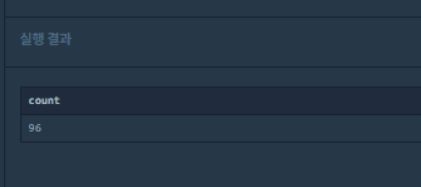
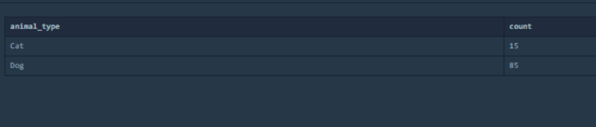
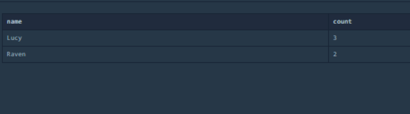

* 중복 제거하기

  ```sql
  SELECT COUNT(NAME) count FROM (SELECT DISTINCT NAME FROM ANIMAL_INS WHERE NAME IS NOT NULL)
  ```

  

* 고양이와 개는 몇 마리 있을까?

  ```sql
  SELECT DISTINCT ANIMAL_TYPE, COUNT(ANIMAL_TYPE) count FROM ANIMAL_INS GROUP BY ANIMAL_TYPE ORDER BY ANIMAL_TYPE
  ```

  

* 동명 동물 수 찾기

  ```sql
  SELECT * FROM (SELECT DISTINCT NAME, COUNT(NAME) count FROM ANIMAL_INS GROUP BY NAME) WHERE count >=2 ORDER BY NAME
  ```

  