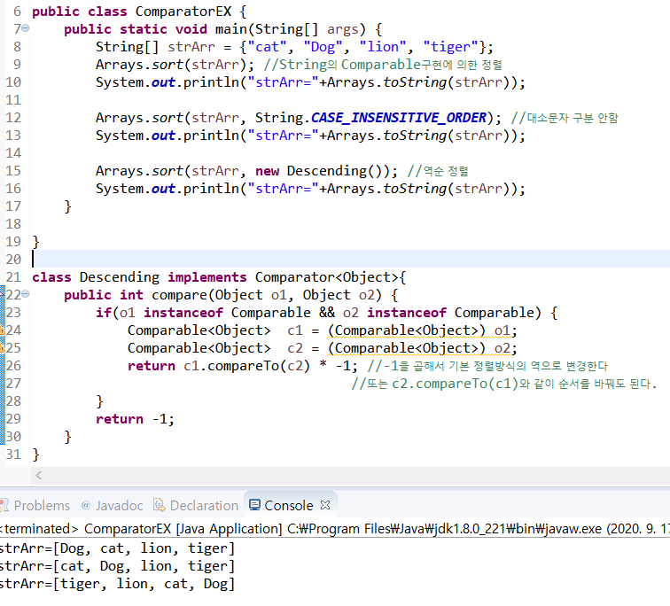
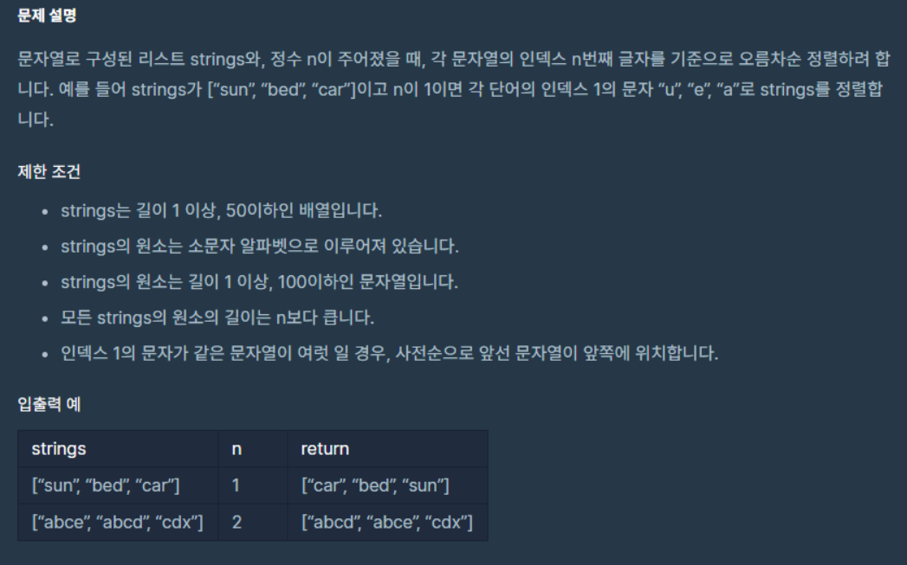

# Arrays

* `copyOf` : 배열의 일부를 복사

```java
int[] arr = {0,1,2,3,4};
int[] arr2 = Arrays.copyOf(arr, arr.length);
int[] arr3 = Arrays.copyOf(arr, 7); //0,1,2,3,4,0,0
```

* `sort` : 배열의 정렬
* `binarySearch` : 배열에 저장된 요소 검색
  * 반드시 **배열이 정렬된 상태**여야 올바른 결과 값을 얻는다.
  * 지정된 값이 저장된 위치(index)찾아서 반환
  * 순차검색

```java
int[] arr = {3,2,0,1,4};
int idx = Arrays.binarySearch(arr,2); //idx=-5 <-잘못된 결과
Arrays.sort(arr); //배열 정렬
System.out.println(Arrays.toString(arr)); //{0,1,2,3,4}
int idx = Arrays.binarySearch(arr,2); //idx =2
```

* 배열 출력 
  * 일차원 배열 출력 : `toString()`
  * 다차원 배열 출력 : `deepToString()`

* 배열 비교 : `equals`

  * 두 배열에 저장된 모든 요소 비교해서 같으면 true, 다르면 false
  * `equals`도 일차원 배열에서만 가능, 다차원 배열의 비교는 `deepEquals()`

  ```java
  System.out.println(Arrays.equals(str2D, str2D2));
  ```

* `asList(Object...a)` : 배열을 List로 변환

  * 단, 추가, 삭제가 불가능하다.

  ```java
  List list = Arrays.asList(new Integer[]{1,2,3,4,5}); //list - [1,2,3,4,5]
  List list = Arrays.asList(1,2,3,4,5);  //list - [1,2,3,4,5]
  ```

  * 크기를 변경할 수 있는 List가 필요하다면 

    ```java
    List list = new ArrayList(Arrays.asList(1,2,3,4,5));
    ```

* 내림차순 : Arrays.sort(array, Collections.reverseOrder());

# Comparator와 Comparable

> `Comparable` : 기본 정렬기준을 구현하는데 사용.
>
> `Comparator` : 기본 정렬기준 외에 다른 기준으로 정렬하고자 할 때 사용



* `static void sort(Object[] a)` : 객체 배열에 저장된 객체가 구현한 Comparable에 의한 정렬
* `static void sort(Object[] a, Comparator c)` : 지정한 Comparator에 의한 정렬


## ex



```java
class Solution {
    public String[] solution(String[] strings, int n) {
        String[] answer = {};
		ArrayList<String> arr = new ArrayList<String>();
		for (int i = 0; i < strings.length; i++) {
			arr.add(strings[i].charAt(n) + strings[i]);
		}
		Collections.sort(arr);
		answer = new String[arr.size()];
		for (int i = 0; i < arr.size(); i++) {
			answer[i] = arr.get(i).substring(1, arr.get(i).length());
		}
    return answer;
    }
}
```

* n번째 character를 문자 맨 앞에 붙여서, 정렬 -> 다시 문자 떼서 출력


# Arrays.sort와 Collections.sort의 차이

> `Arrays.sort`는 배열 정렬
>
> `Collections.sort`는 클래스의 객체 정렬

```java
List<String> list = new ArrayList<String>();
list.add("a");list.add("c");
list.add("가");list.add("A");
list.add("b");list.add("5");
Collections.sort(list);
for(int i=0;i<list.size();i++){
    System.out.print(list.get(i)+" ");
}
Collections.reverse(list);
```

