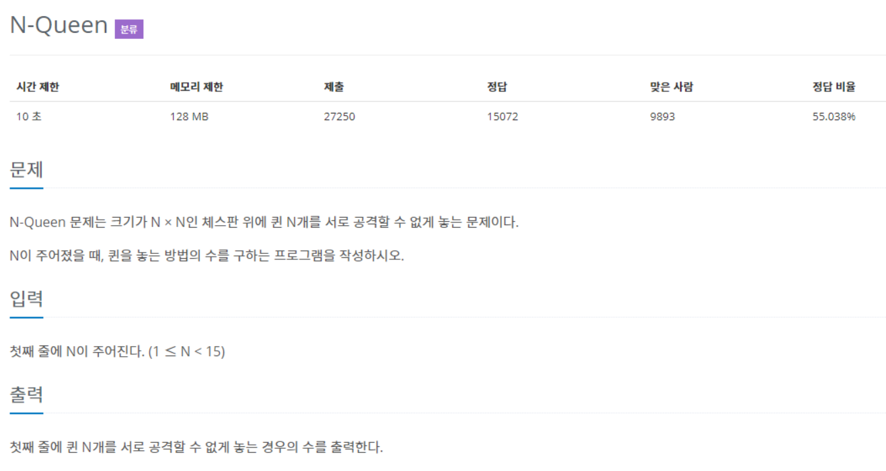
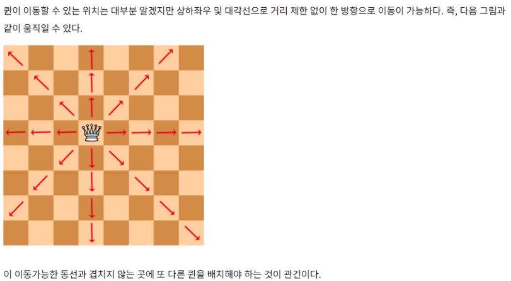

# Backtracking

> 백트래킹 : 가능한 모든 방법을 탐색한다

대표적인 완전 탐색 방법으로는 `DFS(깊이 우선 탐색)`이 있다. DFS는 현재 지점에서 방문할 곳이 있으면 재귀 호출을 이용해서 계속 이동한다. 따라서 무한히 깊은 곳을 찾아야 할 때 효과적이다.

이러한 비효율적인 경로를 차단하고 목표지점에 갈 수 있는 가능성이 있는 루트를 검사하는 방법이 백트래킹 알고리즘이다.

* 가장 깊은 노드부터 탐색하고 더이상 탐색할 자식 노드가 없으면 부모노드로 돌아가(백트래킹) 다음 자식노드를 탐색하는 것이 바로 `DFS`

## N-Queen

