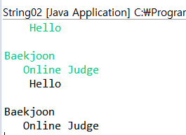

# String

### ex 1) 그대로 출력하기

```java
public class String02 {
	public static void main(String[] args) {
		Scanner sc = new Scanner(System.in);
		while(sc.hasNext()) {
			System.out.println(sc.nextLine());
		}
		sc.close();
	}
}
```




### ex2) 하얀칸

