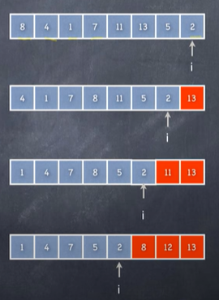
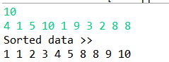

# 알고리즘 ?

* 어떤 문제를 컴퓨터로 풀기 위한 효율적인 절차
* 문제를 푸는 **단계별 절차**를 명확하게 기술
* 알고리즘 문제를 이해하고 효율적으로 해결하는 방법 공부


* 어떤 문제의 모든 입력 사례에 대해 해답을 찾아주는 단계별 절차


## BubbleSort

> 버블정렬
>
> data[0] ~ data[i] 중에서 최대값을 `data[i]` 위치로 몰아가는 일



```java
		for(int i=n-1;i>0;i--) {
			//data[0] ... data[i]
			for(int j=0;j<i;j++) {
				if(data[j] > data[j+1]) {
					//swap
					int tmp = data[j];
					data[j] = data[j+1];
					data[j+1] = tmp;
				}
			}
		}
```

