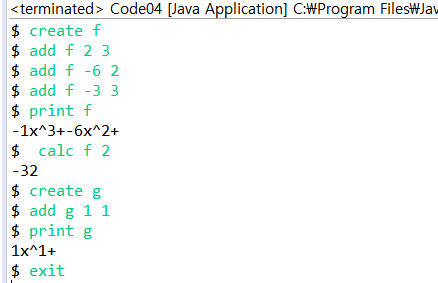

# 문자열


```markdown
* `==` :  `Integer` or `character` 비교
* character가 letter인지 확인하는 함수
!Character.isLetter(str.charAt(i))

그 외 `isDigit()`, `isLowerCase()` , `isSpace()`, `isWhitespace()`: 공백문자
* 단어를 모두 소문자로 변환 : `toLowerCase()`
```

* 배열 선언

  ```java
  		String[] names = new String[1000];
  		int[] numbers = new int[1000]; //정수형 배열
  ```

* 파일 읽기

  ```java
  Scanner inFile = new Scanner(new File(fileName));
  ```

* 파일 출력

  ```java
  PrintWriter pw = new PrintWriter(new FileWriter(fileName));
  ```

* **String.valueOf()** : 파라미터가 NULL 이면 문자열 `NULL` 만들어서 반환

* **toString()** : 대상 값이 NULL 이면 NPE 발생, Object에 담긴 값이 Stirng이 아니어도 출력한다.

# 클래스

> 참조변수
>
> **서로 관련있는 데이터들을 하나의 단위로 묶어두기 위한 것.**

* 클래스는 **하나의 변수 타입**이다. 마치 int, double처럼

* 사용자 정의 타입

  * 객체 생성

  ```java
  Person1 first = new Person1(); //Person1타입의  first변수 생성
  ```

  * 실제 데이터가 저장될 객체는 new명령으로 따로 만들고, 참조변수에는 그 객체의 주소를 지정 해준다.

## 클래스와 객체

> 배열은 프리미티브 타입이 아니다. (int O int[] X)
>
> *프리미티브 : 기본으로 제공해주는 타입*
>
> 배열의 각 원소가 프리미티브 타입인거지 배열 자체가 프리미티브 타입인 것은 아니다. 

```java
int[] numbers = new int[8]; //배열형 객체
//numbers : 주소를 정하는 참조 변수
Person1[] members = new Person1[8]; 
//members는 배열의 이름이므로 참조 변수이다.
```

## 예제

* 다항함수

> 항들의 합, 항은 계수와 지수에 의해서 정의

```java
public class Term{
    public int coef; //계수
    public int exp;  //차수
}
```

```java
//하나의 다항식을 표현하기 위한 클래스
public class Polynomial {
	public char name; 
	public Term[] terms;
	public int nTerms =0; //실제로 저장되어 있는 항의 갯수
	
}
```

```java
public static void main(String[] args) {
		Scanner sc = new Scanner(System.in);
		while (true) {
			System.out.print("$ ");
			String command = sc.next();
			if (command.equals("create")) {
				char name = sc.next().charAt(0); // 길이가 1인 문자열 입력 -> char
				polys[n] = new Polynomial();
				polys[n].name = name;
				polys[n].terms = new Term[100];
				polys[n].nTerms = 0;
				n++;

			} else if (command.equals("add")) { // add f 2 3
				char name = sc.next().charAt(0);
				int index = find(name);
				if (index == -1)
					System.out.println("No such polynomial exists.");
				else {
					int c = sc.nextInt();
					int e = sc.nextInt();
					addTerm(polys[index], c, e);

				}

			} else if (command.equals("calc")) {
				char name = sc.next().charAt(0);
				int index = find(name);
				if (index == -1) System.out.println("No such polynomial exists.");
				else {
					int x = sc.nextInt(); //입력받는 변수 값
					int result = calcPolynomial(polys[index], x);
					System.out.println(result);
										
				}
			} else if (command.equals("print")) {
				char name = sc.next().charAt(0);
				int index = find(name);
				if (index == -1) System.out.println("No such polynomial exists.");
				else {
					printPolynomial(polys[index]);
				}
			} else if (command.equals("exit"))
				break;
		}
		sc.close();

	}
```

```java
//생성
	private static void addTerm(Polynomial p, int c, int e) {
		int index = findTerm(p, e);
		if (index != -1) {
			p.terms[index].coef += c; //원래 -5x^3 + 5x^3
		}
		else {
			int i = p.nTerms -1; //마지막 항
			while ( i >=0 && p.terms[i].exp < e) {
				p.terms[i+1] = p.terms[i];
				i--;
			}
			p.terms[i+1] = new Term();
			p.terms[i+1].coef = c;
			p.terms[i+1].exp = e;
			p.nTerms++;
		}
			

	}

	private static int findTerm(Polynomial p, int e) {
		for (int i = 0; i < p.nTerms && p.terms[i].exp >= e; i++)
			if (p.terms[i].exp == e)
				return i;
		return -1;
	}

	private static int find(char name) {
		for (int i = 0; i < n; i++)
			if (polys[i].name == name)
				return i;
		return -1;
	}
```

```java
//출력
private static void printPolynomial(Polynomial p) {
    for (int i = 0; i < p.nTerms; i++) { 
        printTerm( p.terms[i]);
        System.out.print("+");
    }
    System.out.println();
}

private static void printTerm(Term term) {
    System.out.print(term.coef+"x^"+term.exp); // -x^2 ? ==> +-1x^2로 출력됨
}
```

```java
// 계산
private static int calcPolynomial(Polynomial p, int x) {
    int result = 0;
    for ( int i =0; i< p.nTerms; i++)
        result += calcTerm( p.terms[i], x);
    return result;
}

private static int calcTerm(Term term, int x) {

    return (int) (term.coef * Math.pow(x, term.exp));
    //Math.pow의 return 타입이 double이기때문에 형변환
}
```

[결과]

