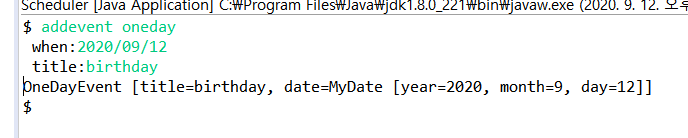
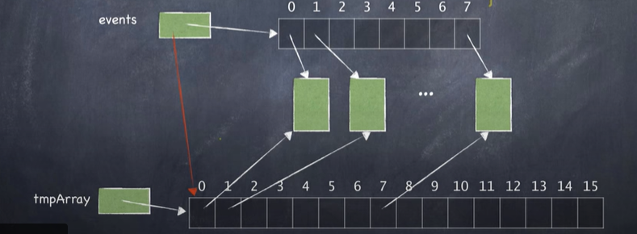

## 메서드

> 서로 관련있는 데이터들 뿐 아니라, 그 데이터와 관련이 깊은 메서드도 함께 묶어둘 수 있다.
>
> -> 응집도를 높이고 결합도를 낮출 수 있다.

* 객체지향 프로그래밍에서 객체란 "데이터" + "메서드"이다.
  * 데이터는 객체의 정적 속성을 표현하며, 메서드는 객체의 기능을 표현한다.

## 클래스

클래스 `Object`는 Java에서 모든 클래스의 **superclass**이다.

* class `Object`의 멤버 메서드
  * boolean `equals(Object obj)`
  * int `hashcode()`
  * String `toString()`
  * class<?> `getClass()`


```java
	//boolean `equals(Object obj)`
	public boolean equals(Test other) { //overriding X
		return a==other.a && x == other.x;
	}
```

```java
	public boolean equals(Object other) { //overriding O
		Test other2 = (Test)other;//Type 캐스팅
		return a==other2.a && x == other2.x;
	}
```


## Splitting a String

* 구분자를 이용해서 단어 쪼개기

```java
String str = "010-2747-3963";
String[] tokens = str.split("-");
for(int i =0;i<token.length;i++){
    System.out.println(tokens[i]);
}
```

```java
private MyDate parseDateString(String dateString) {
    String[] tokens = dateString.split("/");
    int year = Integer.parseInt(tokens[0]);
    int month = Integer.parseInt(tokens[1]);
    int day = Integer.parseInt(tokens[2]);
    //사용자가 입력한 연도,월,일을 이용해 하나의 MyDate객체 생성
    MyDate d = new MyDate(year, month, day);
    return d;
}
```




* 정규표현식
  * `.` : `\\.`

## 배열 재할당

* 배열의 크기는 생성되면 고정된다.

```markdown
배열 events는 참조객체이기 때문에 언제든지 다른 객체로 바꿀 수 있다.

> 기존의 배열을 다른 배열로 이사시킨다.
기존의 배열은 garbage (쓰레기 객체) ->Java는 garbage collection을 자동으로 처리해준다.

-> garbage collection은 따로 신경쓰지 않아도 된다.
```


```java
private void reallocate(){
    Event[] tmpArray = new Event[capacity*2]
        for(int i=0;i<n;i++)
            tmpArray[i] = events[i];
    events = tmpArray;
    capacity*=2;
}
```



## 추상 메서드

* 선언만 있고 구현이 없는 메서드
* 추상 메서드를 포함한 클래스는 추상 클래스
* 추상 클래스는 객체를 만들 수 없다. 서브 클래스를 만드는 용도로만 사용이 된다.


## 제네릭 프로그래밍

> **데이터 형식에 의존하지 않고**, 하나의 값이 여러 다른 데이터 타입들을 가질 수 있는 기술에 중점을 두어 재사용성을 높일 수 있는 프로그래밍 방식

 